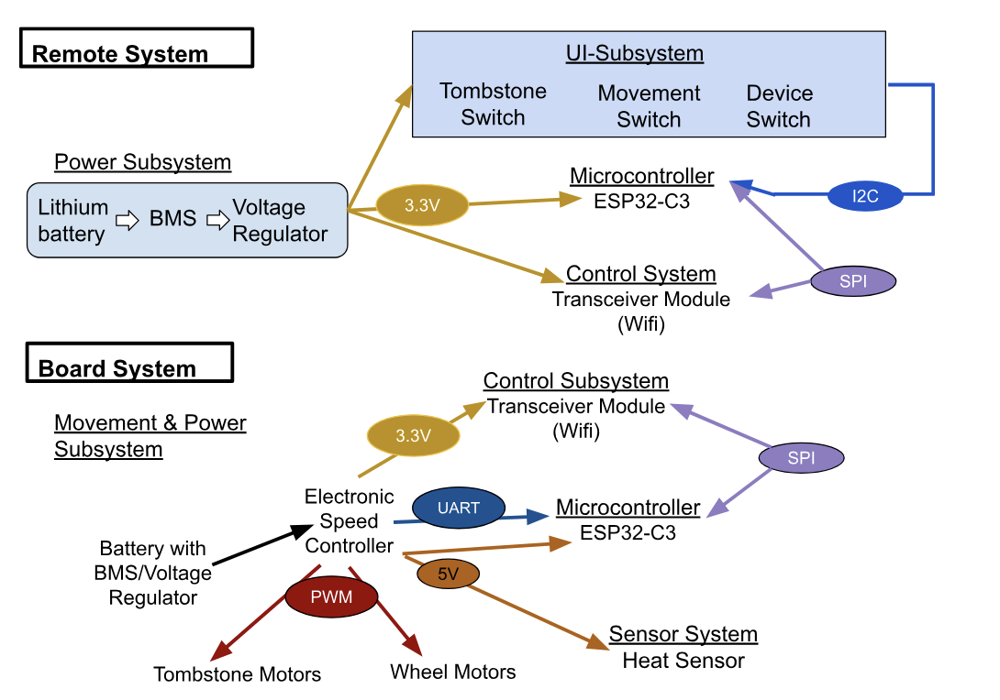
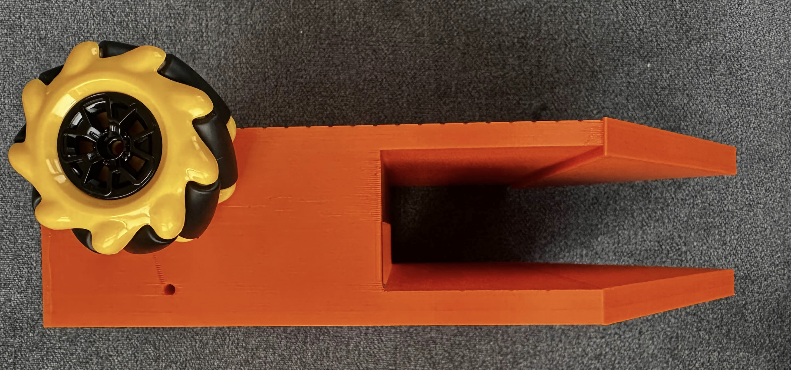
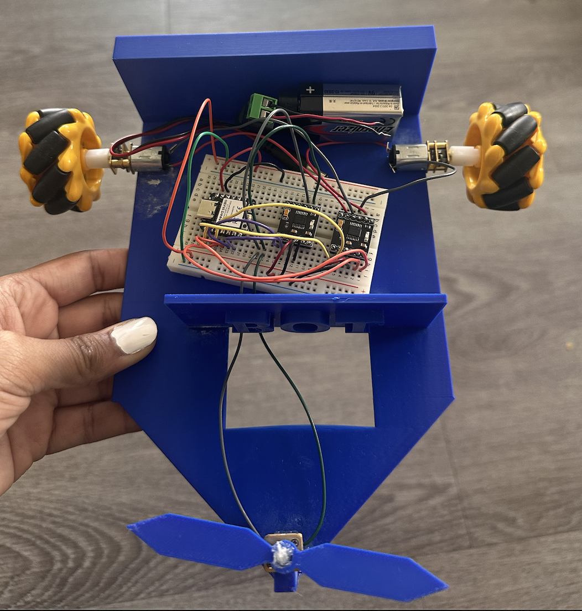
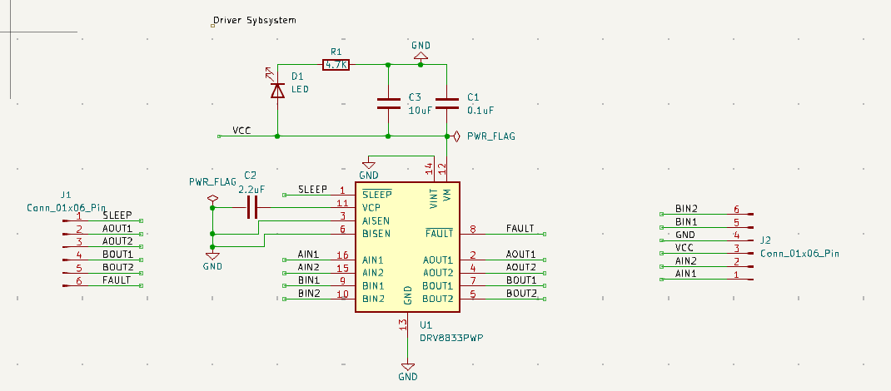

# Gauthami Yenne – Lab Notebook for Antweight Battlebot

## Overview
This notebook documents the design, development, and testing of our Antweight Battlebot project for ECE 445, Spring 2025. It includes weekly entries, design decisions, schematics, experiments, and TA meeting notes. This log supports the creation of the design review, final paper, and serves as a professional engineering record.

---

## Table of Contents

- [January 27, 2025 Project Approval and Team Roles](#january-27-2025-project-approval-and-team-roles)
- [February 9th, 2025 Project Proposal](#february-9th-2025--project-proposal)
- [February 28th, 2025 Begin PCB layout and circuit design](#february-28th-2025-begin-pcb-layout-and-circuit-design)
- [March 1st, 2025 Start PCB Design](#march-1st-2025-start-pcb-design)
- [March 12th, 2025 Refine PCB and Test New Schematic](#march-12th-2025-refine-pcb-and-test-new-schematic)
- [March 23rd, 2025 Ordered PCB and Rechecked the footprints](#march-23rd-2025-ordered-pcb-and-rechecked-the-footprints)
- [March 27th, 2025 Solder Components](#march-27th-2025-solder-components)
- [April 22nd, 2025 Bench Testing and First Motor Control](#april-22nd-2025-bench-testing-and-first-motor-control)
- [April 23rd, 2025 Evaluate 3D print and adjust](#april-23rd-2025-evaluate-3d-print-and-adjust)
- [April 24th, 2025 Testing Breadboard](#april-24th-2025-testing-breadboard)
- [April 26th, 2025 Final Chasis Design](#april-26th-2025-final-chasis-design)
- [May 2nd, 2025 Late PCB arrived](#may-2nd-2025-late-pcb-arrived)
- [References](#references)

---

## January 27, 2025 Project Approval and Team Roles

**Date:** January 27, 2025  
**Objective:** Define team roles, finalize project concept  
**Work Done:**
I wrote and submitted the initial project proposal. I also defined the system goals. As a team assigned team roles and subsystems. I helped create the initial Block diagram which included all the parts and figured out all the voltage requirements as shown in the diagram below:

**Figure 1:** Initial Block Diagram

---

## February 9th, 2025  Project Proposal 

**Date:** February 9th, 2025  
**Objective:** Figured out weight requirements and Created Proposal  
**Work Done:**
I Revised the proposal to improve and include power calculations for tolerance analysis. I also calculated the weight requirements as shown below:

    Emax RS2205 2600KV: 29g  
    ESP-32 Dev kit: 28.35g  
    THP 325-3SR70J Battery (x2): 70g  
    Greartisan DC 3V 19RPM N20 Motor: 9g  
    DRV8833 Motor Driver: 1.5g  
    3 wheels: 210g  
    LM335AH: 0.3g  
    3D printed parts estimate: 200g  
    **Total Weight:** 583.15g / **Limit:** 907.18g

I rechecked the System Power Calculations:

| Subsystem             | Voltage | Current Estimate | Power Estimate            |
|-----------------------|---------|------------------|----------------------------|
| Weapon Motor (RS2205) | 11.1V   | Up to 25A        | 150W–277.5W                |
| Mobility Motors (N20) | 3V      | 0.03–1A          | 0.09W–3W                   |
| ESP32 + Peripherals   | 3.3V    | 0.25A            | 0.825W                     |
| Motor Driver (DRV8833)| 5V      | ~1A              | Up to 5W                   |
| Temperature Sensor    | 5V      | ~0.1mA           | ~0.0005W                   |
|   Total (Peak)        | -       | -                | ~357W (Peak), ~178W Typical |
|   Battery Output      | 11.1V   | 2 × 22.75A       | ~504.4W available          |

Power Calculation Breakdown:  
We used the formula:

**Equation 1:**  
P = V*I — where **P** is power (W), **V** is voltage (V), and **I** is current (A).

We use this equation throughout the notebook to validate power requirements.
- Weapon Motor (RS2205):  
  11.1V × 13.5A = 149.85W (typical)  
  11.1V × 25A = 277.5W (peak)

- Mobility Motors (N20 ×2):  
  3V × 0.03A = 0.09W (idle)  
  3V × 1A = 3W (peak)

- ESP32 + Peripherals:  
  3.3V × 0.25A = 0.825W

- Motor Driver (DRV8833):  
  5V × 1A = 5W

- Temperature Sensor:  
  5V × 0.0001A = 0.0005W

- Battery Output:  
  11.1V × (2 × 22.75A) = 504.4W available

These calculations confirm that our battery output supports the expected peak consumption while maintaining safe operating margins.

---

## February 28th, 2025 Begin PCB layout and circuit design
**Date:** February 28th, 2025
**Objective:** Begin PCB layout and circuit design  
**Work Done:**
I finalized the necessary parts and as listed below and ordered the parts that were needed ASAP:
  - ESP32-C3 DevKitM-1: Compact RISC-V microcontroller with built-in Wi-Fi. Hosts a local web server to receive commands and sends PWM to motor drivers. Operates at 3.3V.
  - Greartisan DC 3V 19RPM N20 Motors: High-torque, low-speed motors to drive wheels.
  - DRV8833 Dual H-Bridge Driver: Enables bidirectional motor control.
  - LM335AH Temperature Sensor: Mounted near the weapon motor to detect overheating.
- Prices of the components:
  - ESP32-C3 DevKitM-1 - $13  [Link](https://www.amazon.com/HiLetgo-ESP32-C3-DevKitM-1-Development-ESP32-C3-MINI-1-ESP32-C3FN4/dp/B0CDWY6GDJ?source=ps-sl-shoppingads-lpcontext&ref_=fplfs&psc=1&smid=A30QSGOJR8LMXA)
  - DRV8833 or L9110H Motor Driver - $8  [Link](https://www.amazon.com/KOOBOOK-DRV8833-Module-Bridge-Controller/dp/B07S7Z8CFL/ref=sr_1_2?crid=3S1F21ZMLS27B&dib=eyJ2IjoiMSJ9.dLM3Kpd0V8IvEV9GNbQRKM5sPJERBPGjFUXKKjeNhdLN3zxKqOHs326EiMgZ7VqpV-2FiHgNxq3TwGhn1sHRGUhOvqTQ3dcPavKRfo5h0ytJlz3RQB2bdC7VzSTHJhsQVHvoz2S9CVTCZKBw2DcqQ5ako4agGzfUlq0GQwnC3C9PMRoCaQiRCrLXRFD327jdY-eREiDYP35x7rYiCuEJWtindrd7j3YvelwAGKmsJfktqZw9mBcEkww-6vjrcL9KFEHseE-AqDogzc2nhWxsxyLEvVcPgIEgImmZE3Brp0Krkhu_o2_umaDlZ68FJf4hfv-kh6MByjSJd3gRzUz-LYdlnNxKVvMtfY7MJRDUl14.r8bvN6GuCJO6D9M4w_Skix2AoMZhd7E4WP-4m6kmY4w&dib_tag=se&keywords=DRV8833&qid=1740529371&s=industrial&sprefix=drv8833%2Cindustrial%2C118&sr=1-2&th=1)
  - Thunder Power Battery - $20.99  
  - Pololu Motors (x2) - $28.95  
  - Compatible Wheels (x3) - $8.95  [Link](https://www.amazon.com/Greartisan-100RPM-Torque-Reduction-Gearbox/dp/B07FVQ7VPX/ref=asc_df_B07FVQ7VPX?mcid=4f61147da4de3743823193db903ff739&hvocijid=5759737562941062527-B07FVQ7VPX-&hvexpln=73&tag=hyprod-20&linkCode=df0&hvadid=730432682330&hvpos=&hvnetw=g&hvrand=5759737562941062527&hvpone=&hvptwo=&hvqmt=&hvdev=c&hvdvcmdl=&hvlocint=&hvlocphy=9022196&hvtargid=pla-2281435178378&th=1)
  - **Total:** ~$80

**TA Meeting:**  
- The TA gave us lockers and lab kit for the class

---

## March 1st, 2025 Start PCB Design

**Date:**  March 1st, 2025
**Objective:** Start PCB Design
**Work Done:**
I helped add the PCB with two voltage regulators one to step down to 5V another to step down to 3.3V with Nandika. Then I created the connections to the Drivers to the ESP. Then I sent it to Jay to complete the PCB level design connections after completing all the schematic Design connections. Then after Jay laid out the components I completed the final PCB Gerber files to send to order.
Below I have attached an image of the PCB I had at the end of this task

**Figure 2:** PCB Trial #1 

---

## March 12th, 2025 Refine PCB and Test New Schematic
**Date:** March 12th, 2025
**Objective:** Refine PCB and test new schematic  
**Work Done:**
I Created new schematic with improved connections Added second DRV8833 for tombstone control and I realized that we are having an outline error and went to office hours to get help to debug the error
and realized that I was missing the square outline around the PCB in edge.cuts layer.
Then I made a checklist to figure what needs to be done next to complete the revised PCB
- Checklist for next revision of PCB:
  - Verify driver/ESP connections
  - Choose correct capacitor footprints (0805 vs tantalum)
  - Validate DRV8833 footprint

**Figure 3:** Here is a picture of the new PCB Trial #2

I realized that we are missing some of the auxiliary components to the driver chip so I Updated the driver schematic on the PCB based on this youtube video for the DRV8833 driver: [Link](https://www.youtube.com/watch?v=3dlswKrZEcA&t=801s)

---

## March 23rd, 2025 Ordered PCB and Rechecked the footprints

**Date:** March 23rd, 2025 
**Objective:** Ordered PCB and Rechecked the footprints
**Work Done:**
We realized there was an issue with the footprint and corrected it into our PCB. I Checked the ECE shop to make sure we have the appropriate capacitors and parts to solder onto the board

---

## March 27th, 2025 Solder Components

**Date:** March 27th, 2025 
**Objective:** Solder Components
**Work Done:**
I worked with Jay to solder the components we had at the time which were the capacitors and resistors onto the PCB.

---

## April 22nd, 2025 Bench Testing and First Motor Control

**Date:** April 22nd, 2025  
**Objective:** Test motor control via ESP32 + DRV8833  
**Work Done:**
Here I did initial testing which showed that only the power subsystem worked. I then moved to the breadboard, confirmed motor function via PWM since PCB was having issues. I also used the following data sheets to create the appropriate connections on the bread board.

**Figure 4:** The following is the data sheet for the motor driver

**Figure 5:** The following is the data sheet for the ESP32C3

Then used the following code to test the wheels functionality each time we wanted to run a base test:
[View PCB_ESP_TEST.ino](./PCB_ESP_TEST.ino)

**Measurements** 

Here is the measurement of the output of the 5V and 3.3V Voltage Regulator on the PCB for the power subsystem. The 5V will be used for the motors and the 3.3V will be used for the ESP

**Figure 6:** 5V Voltage Regulator Output on the PCB

**Figure 7:** 3.3V Voltage Regulator Output on the PCB

- Also finalized the new updated block diagram which is attached below
**Figure 8:** Block Diagram

---

## April 23rd, 2025 Evaluate 3D print and adjust  

**Date:** April 23rd, 2025
**Objective:** Evaluate 3D print and adjust  
**Work Done:**
I found out that the ABS was used instead of PET-G and ABS is to heavy. I also realized that we had designed the robot to have wheels that are to high so I redesigned bot to be shorter and lighter. Then I updated spreadsheet to track part weights. I Adjusted wheel mount height as the wheel holes were placed too high. I attached the link to my CAD design below.

**TinkerCAD Link:**  
[Design File](https://www.tinkercad.com/things/1qpqPXCBS9p-bottom/edit?returnTo=https%3A%2F%2Fwww.tinkercad.com%2Fdashboard&sharecode=AA-KI3Bmg5dcyBxRz8_BAfUHwUg40pOsH4alZPG4oS0)

Here is the picture of the 3-D print car I took when I picked up the initial design. 
**Figure 9:** Block Diagram

---

## April 24th, 2025 Testing Breadboard

**Date:** April 24th, 2025  
**Objective:** Resolve motor control issues  
**Work Done:**
I tested the supplied 5V to ESP32 for successful motor operation. I realized that our PCB supplied 3.3V to the 5V pin which is incorrect because the PCB has an internal voltage regulator that steps down to 3.3V. I adjusted the breadboard to have a functional battle bot for the demo using the datasheets as referred earlier in the notebook.I updated Power table with the new battery and 3 Greartisan motors:

Power System  (Based on 9V Battery Setup):

| Subsystem                  | Voltage | Current Estimate       | Power Estimate         |
|---------------------------|---------|------------------------|------------------------|
| Weapon Motor (RS2205)     | 9V      | Up to 25A (burst)      | ~225W (burst)          |
| Mobility Motors (N20 ×2)  | 5V      | 0.06–2A total          | 0.3W–10W               |
| ESP32-C3 + Peripherals    | 3.3V    | 0.25A                  | 0.825W                 |
| Motor Drivers (×2 DRV8833)| 5V      | ~2A combined           | ~10W                   |
| Voltage Regulators        | 9V in   | ~0.5–1.2A total (est.) | Losses ~2–4W           |
| **Total (Peak)**          | -       | -                      | **~245–250W (peak)**   |
| **Battery Output**        | 9V      | ~0.5–0.6A (alkaline)   | **~4.5–5.4W available** |

Power Calculation Breakdown:  
We used the formula:

**Equation 1:**  
 P = V * I — where **P** is power (W), **V** is voltage (V), and **I** is current (A).

We use this equation throughout the notebook to validate power requirements.
- Weapon Motor (RS2205):  
  9V × 25A = 225W (burst)

- Mobility Motors (N20 ×2):  
  5V × 0.06A = 0.3W (idle)  
  5V × 2A = 10W (peak)

- ESP32-C3 + Peripherals:  
  3.3V × 0.25A = 0.825W

- Motor Drivers (×2 DRV8833):  
  5V × 2A = 10W

- Voltage Regulators:  
  Losses estimated at ~2–4W based on drop-out and current draw

- Battery Output (alkaline 9V):  
  9V × 0.5A = 4.5W  
  9V × 0.6A = 5.4W

These calculations show that a 9V alkaline battery cannot reliably power the system under load, especially with the RS2205 motor, which alone exceeds the available power.

---

## April 26th, Final Chasis Design

**Date:** April 26th, 2025
**Objective:** Evaluate 3D print and adjust  
**Work Done:**
We decided to remove the top area of the battlebot so we reprinted the Chassis and assembled everything. I already had the assembled circuit board so I assembled gluing of both parts together to build the final product.

Here is the picture of the final assembled battlebot:
**Figure 10:** Final Design

---

## May 2nd, Late PCB arrived

**Date:** May 2nd, 2025
**Objective:** Late PCB arrived
**Work Done:**
- The Driver PCB I designed and the Power system PCB that Jay Designed arrived too late. When it arrived it had grounding issues in the Power System PCB. Because of this issue the driver PCB we planned to connect to the power system PCB also did not work. 

Here I attached the Driver PCB I created according to this[Link](https://lastminuteengineers.com/dual-dc-motor-driver-drivers/) :

**Figure 11:** Driver PCB

---

## References

- [ESP32-C3 DevKitM-1 Datasheet (HiLetgo)](https://www.amazon.com/HiLetgo-ESP32-C3-DevKitM-1-Development-ESP32-C3-MINI-1-ESP32-C3FN4/dp/B0CDWY6GDJ)
- [DRV8833 Dual H-Bridge Motor Driver Datasheet](https://www.ti.com/product/DRV8833)
- [Thunder Power TP325-3SR70J Battery Datasheet (Amazon Listing)](https://www.amazon.com/Thunder-Power-325mAh-Battery/dp/B00TIY3CN4)
- [Pololu Greartisan DC 3V 19RPM N20 Motors (Amazon)](https://www.amazon.com/Greartisan-100RPM-Torque-Reduction-Gearbox/dp/B07FVQ7VPX)
- [LM1117 Voltage Regulator Datasheet (TI)](https://www.ti.com/product/LM1117)
- [LM35 Temperature Sensor Datasheet (TI)](https://www.ti.com/product/LM35)
- [ESP32-C3 Pinout Diagram – Seeed Studio XIAO](https://wiki.seeedstudio.com/XIAO_ESP32C3_Getting_Started/)
- [DRV8833 Pinout Diagram – Last Minute Engineers](https://lastminuteengineers.com/dual-dc-motor-driver-drivers/)
- [KiCad EDA Tool](https://www.kicad.org/)
- [YouTube – DRV8833 Logic Explanation (Video)](https://www.youtube.com/watch?v=3dlswKrZEcA&t=801s)
- [TinkerCAD Design File for 3D Print](https://www.tinkercad.com/things/1qpqPXCBS9p-bottom/edit?returnTo=https%3A%2F%2Fwww.tinkercad.com%2Fdashboard&sharecode=AA-KI3Bmg5dcyBxRz8_BAfUHwUg40pOsH4alZPG4oS0)
- [Keysight 34461A Multimeter Product Page](https://www.keysight.com/us/en/product/34461A/truevolt-digital-multimeter-6-digit-34461a.html)
- [ECE 445 Course Wiki](https://ece.illinois.edu/ece445/wiki)

