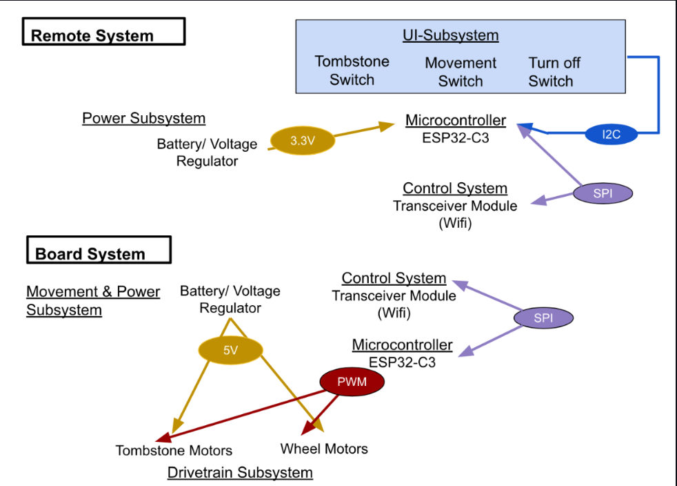
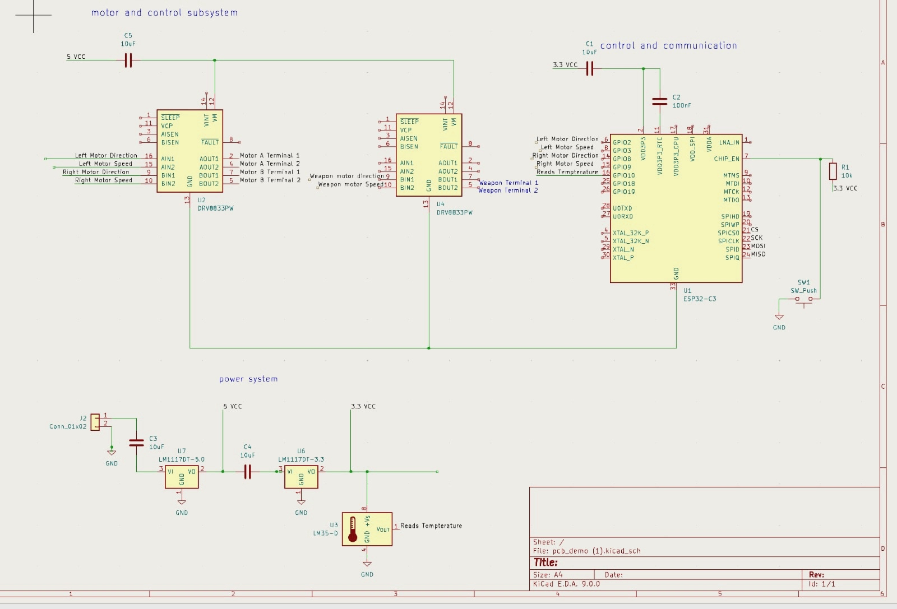
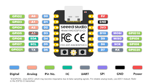
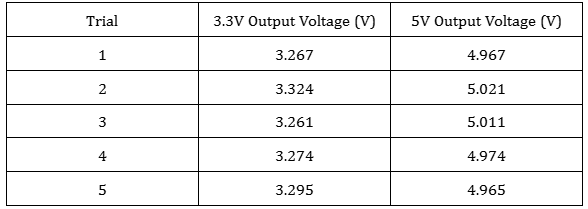

# Jingyu Kang

# 02-21-2025 - Discussion for Block Diagram and Overall Design
Professor Gruev gave us ideas on which microcontroller to use for the battlebot as well as recommended to start with a devkit microcontroller on the breadboard to ensure the system is working before moving on. We implemented a block diagram with help from the designs of previous year teams and decided on the overall design of our battlebot.

# 02-26-2025 - Specify Subsystems and Parts Decisions
I separated the whole system into multiple subsystems. The subsystems are power, communication, control, drivetrain, and weapon.
We decided which parts to use for each subsystem based on the weight requirement for the battlebot as well as current and voltage the battlebot would require.
Emax RS2205 2600KV: 29 grams [link](https://www.amazon.com/AKK-RS2205-Brushless-2300KV-Quadcopter/dp/B07BQRGT7Q/ref=asc_df_B07BQRGT7Q?mcid=fe2cc1c3a56b30e1a6770b4a958a7351&hvocijid=12999813650453738980-B07BQRGT7Q-&hvexpln=73&tag=hyprod-20&linkCode=df0&hvadid=721245378154&hvpos=&hvnetw=g&hvrand=12999813650453738980&hvpone=&hvptwo=&hvqmt=&hvdev=c&hvdvcmdl=&hvlocint=&hvlocphy=9022196&hvtargid=pla-2281435177898&psc=1)
ESP32-S3 Dev kit: 28.34952 grams [link](https://www.digikey.com/en/products/detail/espressif-systems/ESP32-S3-DEVKITC-1-N8R8/15295894?gad_source=1&gad_campaignid=20243136172&gbraid=0AAAAADrbLlhhtnoLWqtVhwE0bbbcE0-Wp&gclid=CjwKCAjwiezABhBZEiwAEbTPGPZp21BZ4Snw9LlD9S22v0X3tVhb13g8ak4JieQjjPhMeXBlUN8yDBoCg_QQAvD_BwE&gclsrc=aw.ds)
THP 325-3SR70J Battery (x2): 70 grams [link](https://www.thunderpowerrc.com/products/tp325-3sr70j)
Greartisan DC 3V 19RPM N20 High Torque Speed Reduction Motor: 9 grams [link](https://www.amazon.com/Greartisan-19RPM-3000RPM-Torque-Reduction-Gearbox/dp/B07FVMGBLW)
DRV8833 Motor Driver Board: 1.5 grams [link](https://www.amazon.com/QCCAN-DRV8833-Module-Bridge-Controller/dp/B0BGLH27GG/ref=asc_df_B0BGLH27GG?mcid=34e74f2f77a13d189873163c9e3db6fb&hvocijid=167201370841548178-B0BGLH27GG-&hvexpln=73&tag=hyprod-20&linkCode=df0&hvadid=721245378154&hvpos=&hvnetw=g&hvrand=167201370841548178&hvpone=&hvptwo=&hvqmt=&hvdev=c&hvdvcmdl=&hvlocint=&hvlocphy=9022185&hvtargid=pla-2281435178138&psc=1)
3 wheels: 210 grams [link](https://www.amazon.com/Directional-Electric-Complete-Accessories-Components/dp/B0B6GLYLHZ/ref=sr_1_12_sspa?crid=CU288MZDW386&dib=eyJ2IjoiMSJ9.HpY1-XTdOQ_Xq5oBaf4PJwUVjc0FHmuMC3fCuklCleISKo8-jEiIhuuPQIc6AnGJ19c6UVLyGx6WMo8GS09-k5lWUgIqH7HBJlQBXymHYl0xbRZslSTogAncaM8odf4mEYSa30kJZFho7PERyPZDjOhAGB0ZYqtCfNtMf7f61Q_iALh6ufP0-c_UZ4NIFxfKQOp3VtfWS9pZgpnRxZd3sq0cOxKKfq32Zhz0yPvY2jJC9KtmWH9VwJxyMzdm8XiCNFvI1Qqs9XlWT3U4Ryx-NDH9Q0SlkLZ8sBS4QR2vu7Q.fLTjZMktyG_t0KLkY79MLghHH9LstgpkP3-jQLk93IY&dib_tag=se&keywords=robot+wheels&qid=1746603130&sprefix=%2Caps%2C61&sr=8-12-spons&sp_csd=d2lkZ2V0TmFtZT1zcF9tdGY&psc=1)
LM335AH: 0.3 grams [link](https://www.ti.com/product/LM335A/part-details/LM335AH/NOPB)
Estimation for 3D printed parts: 200 grams
Total Weight: 583.15 grams
Weight Limit: 907.185 grams

# 03-01-2025 - Designing First Round PCB with ESP32-C3
I designed a first round PCB with ESP32-S3 Devkit with a power subsystem using 5V and 3.3V voltage regulators. Both 5V and 3.3V outputs will be used to power the microcontroller as well as DRV8833 motor drivers. The GPIO output pins will be used to send output signals from the microcontroller to the motor drivers.

# 03-03-2025 - Changes for Parts for Round 2 PCB
The voltage output from the voltage regulators are expected to be around 5 volts max since that would be the highest voltage coming out of the regulator. This would not supply enough voltage for the Emax RS2205 2600KV brushless motor we decided to use. Also, since the Emax RS2205 2600KV brushless motor is extremely heavy in weight, we decided to use Greartisan DC 3V 19RPM N20 High Torque Speed Reduction Motor for both wheels on the drivetrain as well as the weapon tombstone motor.

# 03-12-2025 - Set Up Wireless Connection & Breadboard Demo Setup
I created a program with Arduino that would program the GPIO pins on the ESP32 which will be input signals for the motor driver DRV8833. The GPIO pins of the ESP32 is used as an input towards IN1 and IN2 pins as well as IN3 and IN4 pins of the DRV8833 motor driver  respectfully for each side of the motor for the drivetrain which will be sent out to OUT1, OUT2 and OUT3, OUT4 pins as an output towards the DC motor. This will be further incorporated with a python program, which will mount a WiFi connection with the ESP32 and program for direction control as well as weapon speed control.

I also created a breadboard setup in order to test the microcontroller connection towards the two DRV8833 motor drivers and output to the DC motors. For each DC motor, two GPIO pins are connected to IN1 and IN2 of the DRV8833 motor driver, which is then connected to OUT1 and OUT2 and towards the DC motor respectively.

# 03-23-2025 - PCB with Wrong Parts
The ESP32-C3, 5V and 3.3V voltage regulator, and switch for the on and off button are printed on the PCB as smaller than parts we purchased. Therefore, we could not solder the PCB that arrived. I made modifications with the parts and corresponding connections respectively for the next round order.

# 03-25-2025 - Update on DC Motor, Battery, and Wheels
The 390 brushed motor that arrived, which we intended to use for the tombstone weapon system, was extremely heavy and required higher voltage and current input than we expected. The current PCB board we have could supply at max 6 volts and where the operating voltage of the 390 brushed DC motor is 12 volts. Moreover, considering one of the high level requirements is that the weight of the entire battlebot is 2 lbs, the 390 brushed DC motor is too heavy so we decided to use Greartisan DC motor for all of our motors. The THP 325-3SR70J battery did not arrive but since we only require over 5 volts as our starting voltage input, we decided to use a 9 volts battery. For the wheels, we decided to use mecanum wheels for more precise directional change of the battlebot.

# 03-27-2025 - 1st Round PCB Soldering/Testing
The 1st round PCB came. I soldered all the components and tried testing with the 9 volts battery connected as a power input. The voltage read out from the 5 volts voltage regulator and 3.3 volts voltage regulator did not read the correct values of 0.2 volts but rather close to 0.3 volts. The main problem I expected was that the capacitors connected to each voltage regulator are too high which drains the voltage going in and out. The switch is designed to turn on and off the power input to the ESP32 microcontroller.

# 03-28-2025 - Testing PCB with Xiao ESP32-C3
I measured the input voltage of the Xiao ESP32-C3 from the power subsystem implemented using the voltmeter. The values were not reading approximately 5 volts nor 3.3 volts but rather close to 0.4 volts. However, since the values read from the voltage regulator outputs were within 5% of the value, I assume that the problem is with the PCB design.

# 04-03-2025 - Testing Motors Using Power Source
Since the PCB design was faulty, I decided to create a breadboard design using parts that are used on the PCB in order to check the functionality. The breadboard to check the functionality of the ESP32-C3, DRV8833 motor driver, and DC motors were complete and testing was also successful. From multiple trials, the input voltages to the ESP32-C3 was measured within a 5% error margin.

# 04-18-2025 - Initial 3D design
The initial 3D printed design came out to be a failure since the material that got printed out was extremely heavy and the walls where we intended to attach the wheels were extremely thick, making it impossible to attach the DC motors. 

# 04-20-2025 - new PCB order final version
# 04-22-2025 - PCB Modifications for FInal PCB
# 04-26-2025 - Final Chassis 3D Printing Complete + Assemble
4/27 build / test final breadboard with all systems

5/2 test arrived pcb

