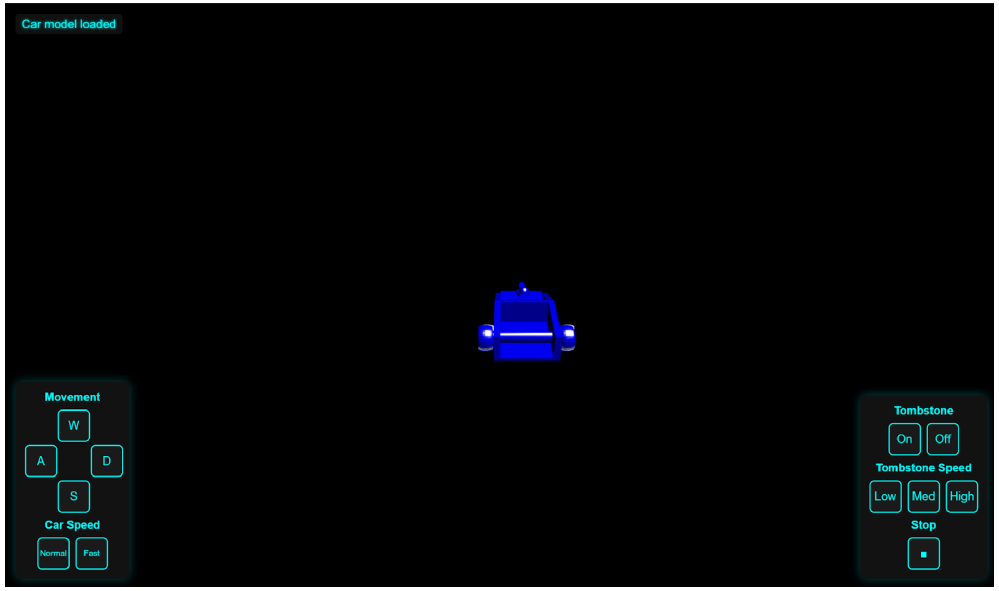

# Nandika Vuyyuri – Lab Notebook for Antweight Battlebot

## Overview
This notebook documents the design, development, and testing of our Antweight Battlebot project for ECE 445, Spring 2025. It includes weekly entries, design decisions, schematics, experiments, and TA meeting notes. This log supports the creation of the design review, final paper, and serves as a professional engineering record.

## January 21, 2025 Project Approval and Team Roles
**Objective:** Brainstorm ideas for project 
**Work Done:**
- Decided between antweight battlebot project and enhanced airtag project
- Looking intro different esp32 controllers as well as other microcontrollers
- created note sheets that had some initial brainstorm such as attacking mechanism, different type of sensors, as well as 3d printing notes

## January 27, 2025 Project Approval and Team Roles
**Objective:** Define team roles, finalize project concept  
**Work Done:**
- Had meeting to work on the project approval and also communicate our strenghts
- Assigned individual roles based on strengths and interest

## February 9, 2025 Project Proposal
**Objective:** Confirm components we need to purchase for project
**Work Done:**
- Selected components such as Pololu Micro Metal Gear Motors(High Torque) as well as the Emax RS2205 motor keeping cost and component weight in mind 
- Begin assessing the components together
| Subsystem             | Estimated Current (A)                  |
| --------------------- | -------------------------------------- |
| Weapon Motor (RS2205) | \~20A (continuous), \~25A (burst)      |
| 2× Drive Motors       | \~3.5A each → 7A total                 |
| ESP32 and logic       | \~0.5A                                 |
| **Total**             | **\~27.5A (continuous), \~32A (peak)** |

## February 12, 2025 Component Reevaluation
**Objective:** Reevaluate components based on requirements
**Work Done:**
- Given the high current draw and cost of the Pololu motors, I have decided to explore alternative motor options that will better suit both the budget and power efficiency
- The current motor selection, in combination with the Emax RS2205 motor, would require more current than the Thunder Power 325 mAh 3s battery can efficiently supply, we need another motor for the weapon

## February 28, 2025 Begin PCB layout and circuit design
**Objective:** Start PCB schematic in KiCad  
**Work Done:**
- Completed the power subsystem as well as the communication subsystem part of the .sch file

- TA gave lockers and kits

## March 1, 2025 Design Document
**Objective:** Finalize the design document and validate power requirements. 
**Work Done:**

- Calculated total voltage, current, and power requirements for the full system.
- Determined that the original power system using a single Thunder Power 325 mAh 3S (11.1V) battery would not provide sufficient current for all subsystems during peak load.
- Concluded that two 11.1V batteries in parallel would be necessary to meet high current demand, particularly for the brushless motor and drivetrain motors during simultaneous operation.
- Verified voltage compatibility of all components: ESP32 (3.3V), DRV8833 (5V), brushless motor (~12V), etc.
- Outlined methods to measure and validate continuous current supply using multimeters and oscilloscopes in the validation section.
- Included risk mitigation measures (e.g., adding capacitors, testing under load) for the power system.
- Parallel Configuration Calculation:

    - Voltage remains = 11.1V
    - Total Capacity = 0.325Ah × 2 = 0.65Ah = 650mAh
    - Total Max Continuous Current = 17.875A × 2 = 35.75A 
    - Total Max Burst Current = 32.5A × 2 = 65A

## March 6, 2025 Breadboard Demo preparation
**Objective:** Begin hardware testing with ESP32 DevKit and evaluate communication options
**Work Done:**
- Set up first breadboard demo using the ESP32 DevKit, mini breadboard, and basic Arduino code
- Independently resolved major communication issue:
    - Initially planned Bluetooth-based control, was able to connect esp32 to my phone via nRF Connect:
    
    - Discovered Bluetooth Classic is not supported on iOS, and our team had no Android devices
    - Pivoted to Wi-Fi control and verified ESP32 soft AP setup
- Confirmed successful Wi-Fi connection between ESP32 and laptop via serial monitor
- This work laid the foundation for later HTTP-based motor control

## March 8, 2025 Python Control Script for ESP32
**Objective:** Build interface to send commands to ESP32 over Wi-Fi
**Work Done:**
- Created a Python script to interact with the ESP32 web server via HTTP requests

- Script allows live control of the robot with commands like forward, backward, left, right, stop
- Validated command responses through serial prints and confirmed correct execution
- This interface was critical for debugging and testing movement logic without relying on a physical controller

## March 23, 2025 Fix PCB errors
**Objective:** Finish first correct  
**Work Done:**
- Identified and corrected outline-related errors in the original PCB layout, including incorrect board edge cuts and dimension misalignments that would have interfered with component placement and mechanical integration.

- Verified proper spacing for all major components: ESP32-C3 module, DRV8833 motor driver, JST battery connector, and supporting passives

## March 26, 2025 Fixing foorprint issues
**Objective:** Redo all footprints
**Work Done:**
- Realized I used all generic footprints for the 1st ordered pcb so redid them using digikey and other references
- ordered another PCB

## April 21, 2025 Web Application
**Objective:** Create web application with live STL viewer 
**Work Done:**
- Set up camera controls and orbit navigation to allow real-time inspection of the robot design.
- Added dynamic lighting and materials to improve rendering clarity
- Implemented on-screen buttons and keyboard listeners to drive the robot forward, backward, left, right.
- Added dedicated keys and buttons to spin the tombstone weapon left or right.
- Integrated a speed slider to allow adjustable robot velocity.
- Buttons and keys work in tandem to provide both manual and keyboard-based control options.

## April 21, 2025 Print Chasis
**Objective:** 3D print the chassis 
**Work Done:**
- 3D printed the first chassis using the original CAD design
- Encountered a design flaw—a gap between the top and bottom of the bot in the model caused a printing defect

## April 22, 2025 Testing esp32 with new web application
**Objective:** Test motor control via ESP32  
**Work Done:**
- Confirmed motor operation using a breadboard setup.
- Encountered PCB power delivery issue — board failed to correctly supply 5V to ESP32.
- Used DRV8833 and ESP32-C3 datasheets to investigate and debug the integration issue.
- Combined hardware testing insights with web interface design to align software commands with motor driver specs.

## April 23, 2025 2nd Printing
**Objective:** Test 3D printed body  
**Work Done:**
- Reprint the chassis using a 3D printer from the Industrial Engineering department 
- Reoriented the CAD schematic to avoid the previous print issue
- The material used in this printer was ABS, so it was extremely heavy and we decided to not continue with this model
- Adjusted design to lower bot height

## April 26, 2025 2nd Printing
**Objective:** Completed 3D printed chasis  
**Work Done:**
- Completed a third 3D print of the chassis, refining the design to improve motor and wheel integration.
- The updated design resulted in a cleaner, more secure fit for drivetrain components, improving assembly quality and reliability.

## April 27, 2025 Final Assembly and Testing
**Objective:** Integrate all components and verify funtionality
**Work Done:**
- Assembled full robot including motors, spinner weapon, and finalized PCB.
- Verified directional movement, speed control, and spinner actuation via web interface.
- Ensured consistent power delivery and successful command response via Wi-Fi.
- Conducted live test of full system for 30+ minutes.
- Controller with all speeds  maintained significant delay (>100ms) during control signal execution and lags after pressing multiple keys quickly (this is due to keypress triggers being queued in javascript) so switched over to the original mono-speed python script with minimal delay (<50ms>)

- Validated drive control, weapon spin torque, and real-time interface sync.
- Robot successfully navigated a test arena with responsive controls.

## References
- ESP32-C3 DevKitM-1 Datasheet (HiLetgo)
- DRV8833 Dual H-Bridge Datasheet
- LM1117 Voltage Regulator Datasheet (TI)
- LM35 Temp Sensor Datasheet
- ESP32 Pinout Diagram – Seeed Studio
- KiCad EDA Tool
- YouTube – How Brushless Motors Work — https://www.youtube.com/watch?v=VnfX9YJbaU8
- YouTube – How MOSFETs Work — https://www.youtube.com/watch?v=TEwy4QPfhsw
- TinkerCAD Design File
- Keysight Multimeter 34461A
- ECE 445 Wiki
